# Mini-VPN

Python으로 구현한 경량 VPN. UDP 소켓 + TUN 인터페이스 기반이며, RSA로 세션 키를 교환하고 AES-256-GCM으로 트래픽을 암호화합니다. Keep-Alive와 주기적 Rekey를 지원합니다.

---

## 1. 프로젝트 소개

### 프로젝트 목적
운영체제의 TUN 가상 인터페이스와 UDP 소켓을 이용해, 두 호스트(Client ↔ Server) 사이에 **암호화된 터널**을 직접 만들어 봅니다. 상용 VPN(OpenVPN, WireGuard 등)이 내부적으로 어떻게 동작하는지 — 키 교환, 패킷 캡슐화, 세션 유지, 키 재협상 — 를 최소 구성으로 학습하는 것이 목적입니다.

### 구현 기능
- TUN 인터페이스를 통한 L3(IP) 패킷 캡처 및 주입
- UDP 기반 커스텀 프로토콜 (VERSION + TYPE + PAYLOAD)
- RSA-2048(OAEP)로 AES 세션 키 안전 전달
- AES-256-GCM으로 페이로드 기밀성 + 무결성 보장
- Keep-Alive를 통한 세션 생존 확인
- 주기적 Rekey(세션 키 재생성)로 장기 키 노출 위험 감소
- Server 측 세션 Timeout 처리

### 전체 구조
```
        [ Client Host ]                          [ Server Host ]
   응용프로그램 (curl 등)                        응용프로그램 / 라우팅
          │                                            │
     tun0 (10.0.0.1)                              tun0 (10.0.0.2)
          │  os.read / os.write                        │
     client.py  ── UDP(암호화) ──────────────────  server.py
          │        인터넷 / LAN                         │
       socket ─────────────────────────────────────  socket(:5000)
```
Client가 tun0에서 읽은 IP 패킷을 AES로 암호화하여 UDP로 Server에 전송하고, Server는 복호화하여 자신의 tun0에 기록합니다. 반대 방향도 동일합니다.

### 동작 영상

**Client 측 데모**

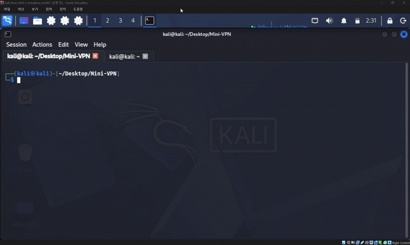

**Server 측 데모**

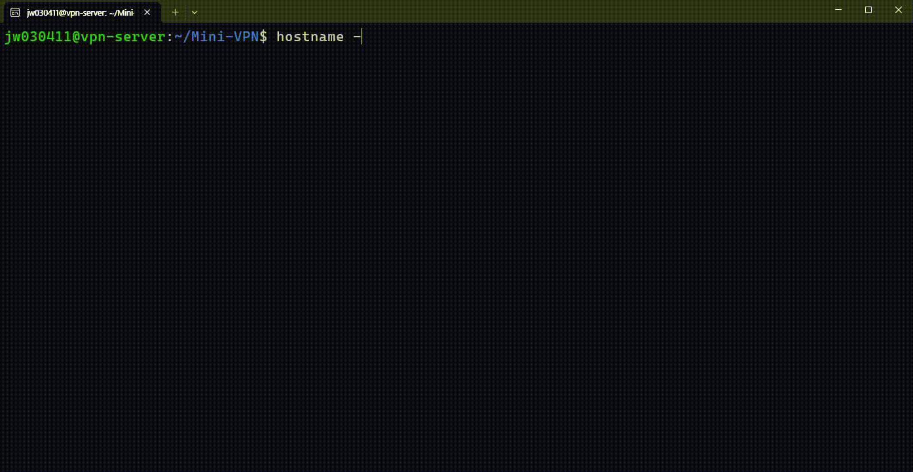

---

## 2. 프로젝트 구조

```
Mini-VPN/
│
├── client.py          # 클라이언트 메인 (TUN 설정 + 이벤트 루프)
├── server.py          # 서버 메인 (TUN 설정 + 이벤트 루프)
├── session.py         # 세션 상태 관리 클래스
├── protocol.py        # 패킷 포맷 정의 및 build/parse
├── key_exchange.py    # RSA 키 생성/저장/로드, 세션 키 암·복호화
├── crypto.py          # AES-256-GCM 암·복호화, 키 생성/저장/로드
├── handlers.py        # 패킷 타입별 처리 로직 + 송신 함수
├── config.py          # 상수/경로/타이머 설정
│
├── keys/              # (최초 서버 실행 시 자동 생성)
│    ├── server_private.pem
│    └── server_public.pem
│
├── docs/              # README용 GIF/스크린샷
│
├── requirements.txt
├── README.md
└── .gitignore
```

> 참고: 초기 설계안에 있던 `packet.py / tun.py / route.py / keepalive.py / rekey.py / util.py` 는 별도 파일로 분리하지 않고, 각 기능이 아래 파일들에 통합되어 있습니다.
> - 패킷 정의 → `protocol.py`
> - TUN 설정 → `client.py` / `server.py` 상단
> - Keep-Alive / Rekey 로직 → `client.py` 메인 루프 + `handlers.py`
> - 암호화 유틸 → `crypto.py`, `key_exchange.py`

### 각 파일 역할

**`client.py`** — 클라이언트 진입점.
- `/dev/net/tun`을 열어 `tun0` 인터페이스를 생성하고 `10.0.0.1/24`를 할당합니다.
- 인자로 `--server`(서버 IP), `--port`(기본 5000)를 받습니다.
- 시작 시 `KEY_REQUEST`를 서버에 보냅니다.
- 메인 루프에서 `select`로 tun fd와 UDP 소켓을 감시하며:
  - tun0에서 읽은 패킷 → AES 암호화 후 UDP 전송
  - UDP로 받은 패킷 → 타입별 처리(공개키 수신, 데이터 복호화 후 tun0에 기록)
  - 주기적으로 Keep-Alive 전송, Rekey 수행

**`server.py`** — 서버 진입점.
- `tun0`을 생성하고 `10.0.0.2/24`를 할당합니다.
- UDP `5000` 포트에 바인딩합니다.
- 최초 실행 시 RSA 키쌍을 생성/로드합니다.
- 메인 루프에서 `KEY_REQUEST → PUBLIC_KEY 응답`, `AES_KEY 복호화`, `DATA 복호화 후 tun0 기록`, `KEEP_ALIVE`, `TIMEOUT` 을 처리합니다.

**`session.py`** — `Session` 클래스. 클라이언트 주소, 현재 세션 키, `last_seen`(타임아웃 판정), `last_keepalive`, `last_rekey`, 서버 공개키를 보관합니다. 상태를 한곳에 모아 메인 루프를 단순화합니다.

**`protocol.py`** — 와이어 포맷 정의.
- 패킷 = `[VERSION(1B)] [TYPE(1B)] [PAYLOAD...]`
- 타입 상수: `DATA(0x01) KEY_REQUEST(0x02) PUBLIC_KEY(0x03) AES_KEY(0x04) KEEP_ALIVE(0x05)`
- `build_packet()` / `parse_packet()` 제공. 버전 불일치 시 예외를 던집니다.

**`key_exchange.py`** — RSA 담당.
- `generate_keypair()`: RSA-2048 키쌍 생성.
- 서버 개인/공개키 PEM 저장·로드, 공개키 ↔ bytes 직렬화.
- `encrypt_key()/decrypt_key()`: OAEP(MGF1-SHA256) 패딩으로 AES 세션 키를 암·복호화.

**`crypto.py`** — AES 담당.
- `encrypt()/decrypt()`: AES-256-GCM. 12바이트 nonce를 매번 새로 생성.
- `generate_key()`: 256비트 AES 키 생성.
- `save_key()/load_key()`.

**`handlers.py`** — 패킷 타입별 핸들러 + 송신 헬퍼.
- `handle_key_request()`: 서버가 공개키(PEM)를 응답.
- `handle_public_key()`: 클라이언트가 서버 공개키를 받고 세션 키를 만들어 RSA로 암호화해 전송.
- `handle_aes_key()`: 서버가 RSA로 세션 키 복호화.
- `handle_data()`: nonce(앞 12B) + ciphertext 분리 후 AES 복호화.
- `send_data()`: 평문 패킷을 AES 암호화하여 `DATA`로 송신.
- `send_keep_alive()`: 빈 `KEEP_ALIVE` 송신.

**`config.py`** — 설정 상수. 키 저장 경로, `KEEP_ALIVE_INTERVAL=10`, `TIMEOUT=10`, `REKEY_INTERVAL=10`, `SERVER_PORT=5000`.

**`requirements.txt`** — 의존성(`cryptography`).

**`keys/`** — 서버 RSA 키쌍(PEM). 서버 최초 실행 시 자동 생성됩니다. **개인키는 절대 커밋하지 마세요**(`.gitignore`에 포함 권장).

---

## 3. 개발 환경

```
OS
- Ubuntu 26.04 LTS (Virtual Machine)
- (데모 클라이언트는 Kali Linux 환경에서도 동일하게 동작 확인)

Python
- Python 3.12+ (Ubuntu 26.04 기본 제공 버전)

Virtualization
- VirtualBox

Network
- Bridged Adapter (같은 LAN 데모 시) / 포트포워딩 (외부망 데모 시)

IDE
- VSCode

권한
- root 필요 (TUN 생성 및 ip 명령 실행 → sudo)
```

> TUN 인터페이스 생성과 `ip addr / ip link` 조작에는 root 권한이 필요합니다. 두 프로그램 모두 `sudo`로 실행합니다.

---

## 4. 사용 기술

**Python Socket** — 표준 `socket` 모듈로 네트워크 송수신을 직접 구현. 저수준 패킷 제어가 가능합니다.

**UDP (SOCK_DGRAM)** — 연결 지향이 아닌 데이터그램 방식. VPN은 상위 계층(TCP 등)이 재전송을 담당하므로, 터널 자체는 오버헤드가 적은 UDP가 유리합니다(TCP-over-TCP 성능 저하 회피).

**RSA (2048, OAEP)** — 비대칭 암호. 서버 공개키로 AES 세션 키를 암호화해 전달합니다. 사전 공유 비밀 없이 안전하게 대칭키를 주고받기 위한 용도입니다.

**AES (256-GCM)** — 대칭 암호. 실제 트래픽(데이터 패킷)을 빠르게 암호화합니다. GCM 모드는 기밀성 + 무결성(인증 태그)을 함께 제공합니다.

**TUN Interface** — 커널의 가상 L3 네트워크 장치. `/dev/net/tun`을 열고 `ioctl`로 설정하면, tun0으로 라우팅된 IP 패킷을 프로그램이 `read`로 가져오고 `write`로 주입할 수 있습니다. VPN의 핵심 메커니즘입니다.

**Routing** — `ip addr / ip route`로 tun0에 주소를 부여하고 어떤 트래픽을 터널로 보낼지 결정합니다.

**iptables** — (선택) Server를 게이트웨이로 쓸 때 NAT(MASQUERADE)/포워딩 규칙에 사용. 현재 기본 코드는 point-to-point 터널이라 필수는 아닙니다.

**Keep-Alive** — 일정 주기(30s)로 빈 패킷을 보내 세션 생존을 알리고, NAT 매핑이 만료되지 않게 유지합니다.

**Rekey** — 일정 주기(30s)로 세션 키를 새로 생성·교체합니다. 하나의 키로 암호화하는 데이터 양·시간을 제한해 키 노출 시 피해를 줄입니다(forward secrecy 방향의 완화책).

---

## 5. VPN 동작 원리

### 핸드셰이크 및 세션 흐름
```
Client                                  Server
  |                                        |
  |  ── KEY_REQUEST ─────────────────────► |   (세션 시작 요청)
  |                                        |
  |  ◄──────────────────── PUBLIC_KEY ───  |   (서버 RSA 공개키 PEM)
  |                                        |
  | 세션키 생성(AES-256)                    |
  | 공개키로 RSA 암호화                      |
  |  ── AES_KEY (RSA Encrypt) ───────────► |   (서버가 개인키로 복호화)
  |                                        |
  | ========= 암호화된 VPN 세션 수립 ========= |
  |                                        |
  |  ◄──── DATA (AES-256-GCM) ───────────► |   (양방향 IP 패킷 터널링)
  |                                        |
  |  ── KEEP_ALIVE (30s 주기) ───────────► |   (세션/NAT 유지)
  |                                        |
  | REKEY (30s): 새 AES 키 생성             |
  |  ── AES_KEY (RSA Encrypt) ───────────► |   (세션 키 교체)
  |                                        |
  |                              (60s 무응답 시 TIMEOUT → 세션 파기)
```

### 데이터 평면(Data Plane) 상세
```
[Client] 응용 트래픽 → 커널 라우팅 → tun0
   │ os.read(fd)          평문 IP 패킷 확보
   ▼
 AES-GCM encrypt (nonce 12B 생성)
   │  payload = nonce(12B) + ciphertext(+태그)
   ▼
 build_packet(DATA, payload)  →  UDP sendto
   │  ~~~~~~ 네트워크 ~~~~~~
   ▼
[Server] UDP recvfrom → parse_packet
   │  nonce = payload[:12], cipher = payload[12:]
   ▼
 AES-GCM decrypt (태그 검증 실패 시 폐기)
   │ os.write(fd)          평문 IP 패킷을 tun0에 주입
   ▼
 서버 커널이 정상 IP 패킷처럼 처리
```

핵심은 **VPN 프로그램이 IP 계층의 패킷을 통째로 페이로드로 감싸(캡슐화) UDP로 나른다**는 점입니다. 터널 안의 원본 IP 헤더/데이터는 AES-GCM으로 암호화되어 있어, 중간 경로에서는 내용을 볼 수 없습니다.

### 상태 관리 / 타이머
- Server는 매 수신 시 `last_seen`을 갱신하고, 루프에서 `now - last_seen > TIMEOUT(60s)`이면 세션 키를 폐기합니다.
- Client는 `REKEY_INTERVAL(30s)`마다 새 AES 키를 만들어 서버 공개키로 암호화해 전송하고, `KEEP_ALIVE_INTERVAL(30s)`마다 keep-alive를 보냅니다.

---

## 6. 암호화 방식

```
RSA (비대칭)
   ↓  세션 키 안전 전달
AES-256-GCM (대칭)
   ↓  실제 트래픽 암호화
Rekey
      주기적 세션 키 교체
```

### 왜 이렇게 쓰는가 (하이브리드 암호화)
- **RSA만 쓰면 안 되는 이유:** 비대칭 암호는 연산이 매우 느리고, 한 번에 암호화할 수 있는 데이터 크기가 키 길이에 제한됩니다(RSA-2048 OAEP-SHA256은 약 190바이트). 초당 수천 개의 IP 패킷을 RSA로 암호화하는 것은 성능상 불가능하고 크기 제한 때문에 애초에 부적합합니다.
- **AES만 쓰면 안 되는 이유:** 대칭 암호는 빠르지만, **양쪽이 같은 키를 미리 공유**해야 합니다. 안전한 채널이 없는 상태에서 이 키를 네트워크로 그냥 보내면 도청당합니다. 즉 "키를 어떻게 안전하게 전달할 것인가"라는 문제가 남습니다.
- **해결(하이브리드):** 느리지만 키 공유에 강한 RSA로 **AES 세션 키만** 안전하게 전달하고, 빠른 AES로 **대용량 트래픽**을 처리합니다. 실제 상용 프로토콜(TLS 등)도 같은 원리입니다.

### GCM을 쓰는 이유
AES-GCM은 암호화(기밀성)와 함께 **인증 태그**로 무결성/변조 여부를 검증합니다. 공격자가 암호문을 변조하면 복호화 시 태그 검증에 실패해 패킷이 폐기됩니다(`handle_data`가 `None` 반환).

### Rekey의 이유
하나의 세션 키로 무한정 암호화하면, 키가 유출됐을 때 그 키로 보호된 **모든** 과거·미래 트래픽이 노출됩니다. 주기적으로 키를 교체하면 특정 키 유출의 영향 범위가 그 구간으로 한정됩니다.

---

## 7. 프로젝트 실행 방법

> 모든 명령은 **Server, Client 두 대의 머신(VM)** 각각에서 수행합니다.
> TUN 생성 때문에 실행은 반드시 `sudo`가 필요합니다.

### 7-1. Python 및 도구 설치 (양쪽 모두)
```bash
sudo apt update
sudo apt install -y python3 python3-venv python3-pip iproute2
python3 --version   # 3.12+ 확인
```

### 7-2. 코드 배치 및 의존성 설치 (양쪽 모두)
```bash
cd Mini-VPN

python3 -m venv .venv
source .venv/bin/activate

pip install -r requirements.txt
```

> **주의:** `sudo`로 실행할 때 venv의 파이썬을 그대로 쓰려면 venv의 절대경로 인터프리터를 지정하는 것이 안전합니다.
> ```bash
> sudo .venv/bin/python server.py
> sudo .venv/bin/python client.py --server <SERVER_IP>
> ```
> (아래 예시는 편의상 `python3`로 표기)

### 7-3. 서버 실행 (Server VM)
```bash
sudo python3 server.py
```
최초 실행 시 `keys/` 디렉터리에 RSA 키쌍이 자동 생성됩니다.

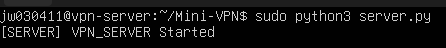

### 7-4. 클라이언트 실행 (Client VM)
```bash
sudo python3 client.py --server <SERVER_IP> --port 5000
```
- `<SERVER_IP>`: 서버가 UDP를 수신하는 IP.
  - 같은 LAN이면 서버 VM의 LAN IP (예: `192.168.0.20`)
  - 외부망이면 공유기의 공인 IP (포트포워딩 필요, 9장 참고)

실행하면 아래처럼 핸드셰이크 로그(KEY_REQUEST → PUBLIC_KEY → AES_KEY)가 순서대로 출력됩니다. (아래 캡처는 공인 IP `219.241.128.162`로 접속한 실제 데모)

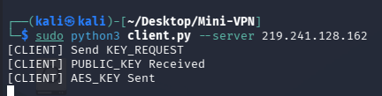

서버 쪽에서도 대응되는 로그가 찍힙니다. `KEY_REQUEST from (39.7.46.245, ...)`는 클라이언트가 LTE 공인 IP로 접속했음을 보여줍니다.

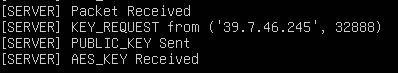

### 7-5. 실행 확인

**tun0 인터페이스 및 주소 확인** — Client는 `10.0.0.1/24`, Server는 `10.0.0.2/24` 여야 합니다.

Client:
```bash
ip addr show tun0
```
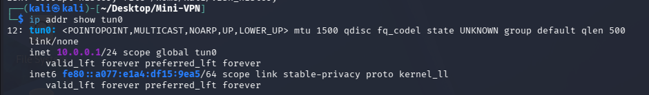

Server:
```bash
ip addr show tun0
```
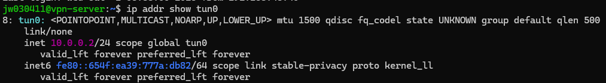

**라우팅 테이블 확인** — tun0이 라우팅에 잡혀 있는지 확인합니다.
```bash
ip route
```
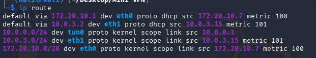

**터널을 통한 외부 통신 확인** — 터널 경유로 외부(8.8.8.8)까지 ping이 통하는지 확인합니다.
```bash
ping -c8 8.8.8.8
```
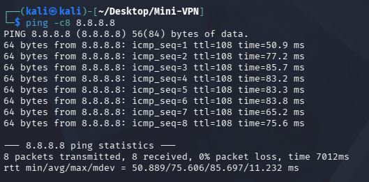

**공인 IP 확인** — `curl ifconfig.me`로 현재 나가는 IP를 확인합니다.
```bash
curl ifconfig.me
```
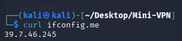

### 종료
Server/Client 모두 `Ctrl + C`로 종료하면 tun0을 자동으로 삭제합니다.

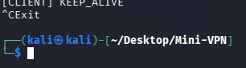

---

## 8. VirtualBox 설정

두 VM(Server, Client)이 서로 통신하려면 네트워크 어댑터를 올바르게 설정해야 합니다. 같은 LAN에서 데모할 때는 **Bridged Adapter**가 가장 간단합니다.

### Server VM
```
Settings

↓

Network

↓

Adapter 1

↓

Enable Network Adapter 체크

↓

Attached to: Bridged Adapter

↓

Name: (호스트의 실제 NIC 선택 — 유선 eth 또는 무선 wlan)
```
<!-- 사진 위치: docs/vbox_server_network.png (VirtualBox 네트워크 설정 스크린샷을 넣으세요) -->

### Client VM
Server와 **동일하게** 설정합니다.
```
Settings → Network → Adapter 1 → Bridged Adapter
```
<!-- 사진 위치: docs/vbox_client_network.png -->

### 설정 후 확인
각 VM에서 `hostname -I`로 LAN IP를 확인하고, 서로 `ping`이 되는지 봅니다. Bridged로 설정하면 두 VM이 물리 공유기 아래 같은 대역의 실제 호스트처럼 보입니다.

Server VM의 IP 확인 (예: `192.168.45.118`):
```bash
hostname -I
```
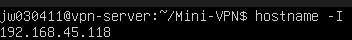

Client VM의 IP 확인:
```bash
hostname -I
```
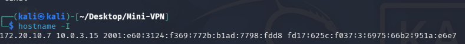

> NAT(기본값)로 두면 VM들이 서로 직접 통신하지 못하므로, 반드시 Bridged(또는 Internal/Host-only + 라우팅)로 바꿔야 합니다.

---

## 9. 포트포워딩

Server IP로 무엇을 지정하느냐는 Client와 Server가 **같은 네트워크에 있는지**에 따라 달라집니다.

### 9-1. 같은 LAN (포트포워딩 불필요)
```
Client                     Server
192.168.0.x   ───────►   192.168.0.x   (UDP 5000)
```
같은 공유기 아래에 있으면 서버의 사설 IP로 바로 접속됩니다.
```bash
sudo python3 client.py --server 192.168.0.20
```
→ **포트포워딩 필요 없음.**

### 9-2. 외부망 (포트포워딩 필요)
```
[Client]  LTE / 다른 네트워크
   │
   ▼
공인 IP (Public IP)
   │
   ▼
Router (공유기)  ── 포트포워딩 ──►  Server (사설 IP)
```
Client가 공유기 밖(예: 휴대폰 LTE 테더링, 다른 건물)에 있으면, 공유기의 **공인 IP**로 접속하게 됩니다. 하지만 공유기는 외부에서 들어온 패킷을 어느 내부 기기로 보낼지 모르므로, **UDP 5000 → 서버 사설 IP:5000** 포워딩 규칙을 등록해야 합니다.

> 실제 이 프로젝트 데모도 이 구성으로 진행했습니다. Client는 LTE(공인 IP `39.7.46.245`)에서 서버 쪽 공유기 공인 IP `219.241.128.162`로 접속했고, 공유기가 UDP 5000을 서버 사설 IP로 포워딩해 터널이 수립되었습니다.

#### ipTIME 공유기
```
관리자 페이지 접속 (보통 192.168.0.1)

↓

고급설정

↓

NAT/라우터 관리

↓

포트포워드 설정
```
등록할 규칙:
```
프로토콜 : UDP
외부 포트 : 5000  (시작~끝 동일)
   ↓
내부 IP  : 192.168.xx.xx   (Server VM의 사설 IP)
내부 포트 : 5000
```
> Bridged 모드에서 Server VM이 받은 사설 IP를 `내부 IP`에 정확히 입력해야 합니다. VM의 IP가 DHCP로 바뀌면 규칙이 어긋나므로, 서버 VM은 고정 IP로 두는 것이 좋습니다.

접속:
```bash
# Client에서, 공유기 공인 IP로 접속
sudo python3 client.py --server <PUBLIC_IP>
```
공인 IP는 서버 쪽 공유기 관리 페이지 또는 `curl ifconfig.me`로 확인합니다.

### 9-3. SK 공유기 / 이중 NAT (삽질 포인트)
가정용 인터넷에서 통신사 모뎀(라우터)과 개인 공유기(ipTIME)를 둘 다 쓰면 **이중 NAT** 구조가 됩니다.
```
Internet
   │
   ▼
SK Router (통신사 모뎀/공유기)   ← 공인 IP는 여기서 끝남
   │  (사설 대역 A, 예: 172.30.x.x)
   ▼
ipTIME (개인 공유기)             ← 또 다른 사설 대역 B, 예: 192.168.0.x
   │
   ▼
Server (192.168.0.x)
```

**왜 안 되는가:**
공인 IP로 들어온 패킷은 먼저 SK Router에 도착합니다. SK Router는 이 패킷을 ipTIME으로 보내야 하고, 이후 ipTIME이 다시 Server로 보내야 합니다. 즉 **포워딩을 두 번** 뚫어야 합니다.
- ipTIME에만 포트포워딩을 하면 → SK Router에서 이미 막혀서 패킷이 ipTIME까지 도달하지 못합니다.
- SK Router 관리 화면 접근이 막혀 있거나 옵션이 제한적이면 포워딩 설정 자체가 어렵습니다.

**해결 방법 (택1):**

1) **양쪽 모두 포트포워딩 (2단 포워딩)**
```
SK Router:  UDP 5000 → ipTIME의 WAN(사설) IP : 5000
ipTIME  :  UDP 5000 → Server 사설 IP : 5000
```
두 단계 모두 규칙을 등록하면 공인 IP:5000 → 최종적으로 Server:5000까지 도달합니다.

2) **DMZ 활용**
SK Router에서 ipTIME을 **DMZ 호스트**로 지정하면, SK Router로 들어오는 (특정/모든) 외부 트래픽이 ipTIME으로 통째로 전달됩니다. 그 다음 ipTIME에서만 포트포워딩(UDP 5000 → Server)을 하면 됩니다. 이중 NAT의 첫 단계를 DMZ로 우회하는 방식입니다.
```
SK Router:  DMZ → ipTIME
ipTIME   :  포트포워딩 UDP 5000 → Server
```

3) **직접 연결 (가장 확실)**
Server를 ipTIME 밑이 아니라 **SK Router에 직접** 연결하거나, 애초에 개인 공유기 없이 한 대의 공유기 아래에 Server/Client를 두면 이중 NAT가 사라집니다.
```
왜 되는가: NAT 계층이 하나뿐이라, 포트포워딩(또는 같은 LAN 접속)을 한 번만 처리하면
          외부→Server 경로가 끊김 없이 이어지기 때문.
```

> **요약:** 잘 안 되면 대개 이중 NAT가 원인입니다. 가능하면 데모는 **같은 LAN(9-1)** 에서 하는 것이 가장 간단하고, 외부망 데모가 꼭 필요하면 DMZ 또는 2단 포워딩을 쓰거나 공유기 계층을 하나로 줄이세요.

---

## 10. 데모 방법

### 실행 순서
```
1) Server 실행        sudo python3 server.py
        ↓
2) Client 실행        sudo python3 client.py --server <SERVER_IP>
        ↓
3) KEY_REQUEST        [CLIENT] Send KEY_REQUEST / [SERVER] KEY_REQUEST from ...
        ↓
4) PUBLIC_KEY         [SERVER] PUBLIC_KEY Sent / [CLIENT] PUBLIC_KEY Received
        ↓
5) AES_KEY            [CLIENT] AES_KEY Sent / [SERVER] AES_KEY Received
        ↓
6) DATA (터널 통신)    ping 8.8.8.8 (터널 경유)
        ↓
7) KEEP_ALIVE         30초마다 [CLIENT] KEEP_ALIVE / [SERVER] KEEP_ALIVE
        ↓
8) REKEY              30초마다 [CLIENT] Rekey Start → Rekey Sent
        ↓
9) TIMEOUT            Client 종료 후 60초 → [TIMEOUT] (addr) 세션 파기
```

### 단계별 확인 포인트

**1. 핸드셰이크 성공** — 서버 콘솔에서 KEY_REQUEST 수신 → PUBLIC_KEY 송신 → AES_KEY 수신이 순서대로 찍힙니다.


**2. AES_KEY 수신 (Rekey 포함)** — 이후 Rekey 때마다 서버가 새 세션 키를 다시 받습니다.

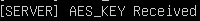

**3. 터널 통신** — Client에서 `ping 8.8.8.8`이 터널을 통해 응답을 받습니다.


**4. Keep-Alive** — 30초 간격으로 양쪽에 KEEP_ALIVE 로그가 반복됩니다.

Client:

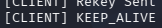

Server:

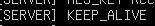

**5. Rekey** — 30초마다 Client가 새 AES 키를 만들어 재전송합니다.

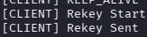

**6. Timeout** — Client를 `Ctrl+C`로 끄고 60초 뒤 서버에 `[TIMEOUT]` 로그가 뜨며 세션이 파기됩니다.

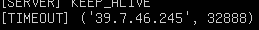

**7. 암호화 확인 (권장 추가 검증)** — 호스트에서 `sudo tcpdump -i any udp port 5000 -X` 로 캡처하면 페이로드가 **암호문(판독 불가)** 으로 보여야 합니다. 평문 IP/데이터가 그대로 보이면 안 됩니다.

---

## 참고: `.gitignore` 권장 항목
개인키와 가상환경, 캐시는 커밋하지 않도록 합니다.
```
.venv/
__pycache__/
*.pyc
keys/server_private.pem
```
> 서버 개인키(`server_private.pem`)가 유출되면 과거에 교환된 세션 키가 복호화될 수 있으므로 절대 저장소에 올리지 마세요.
